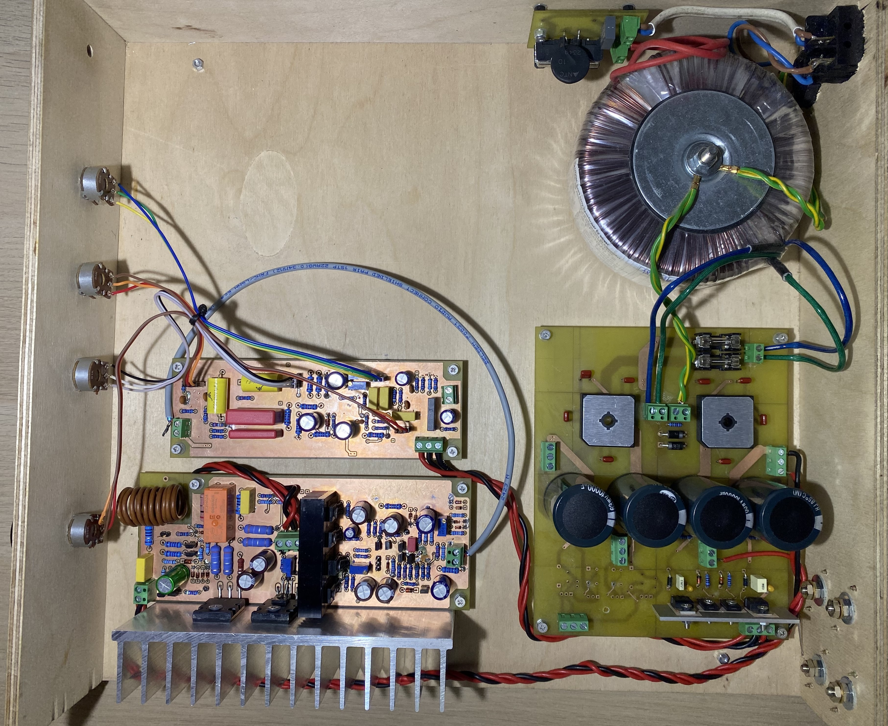
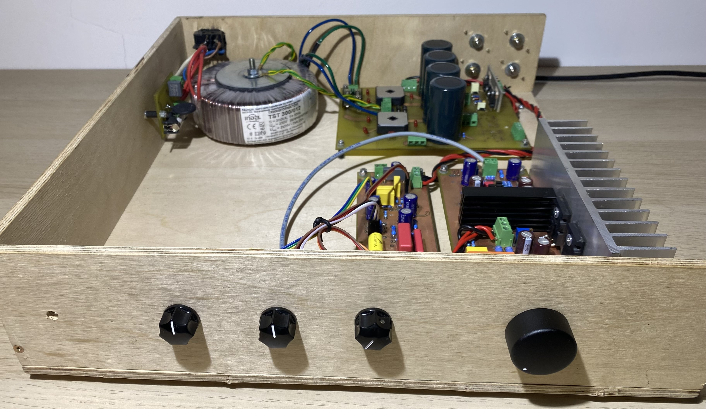
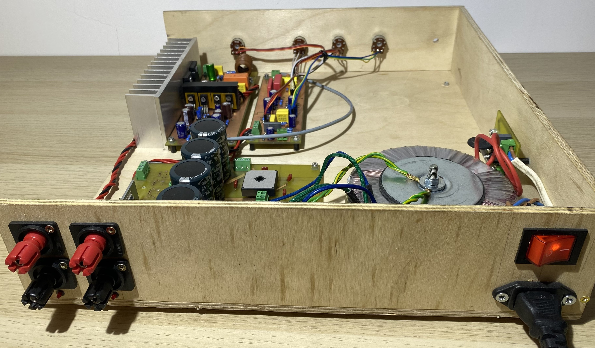
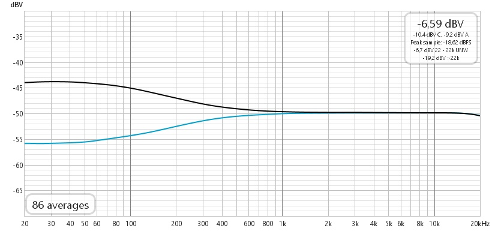
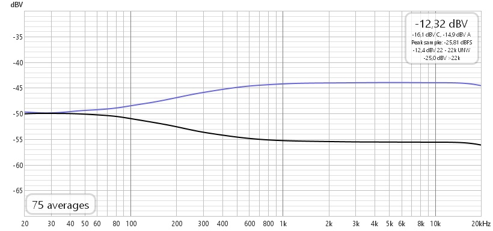
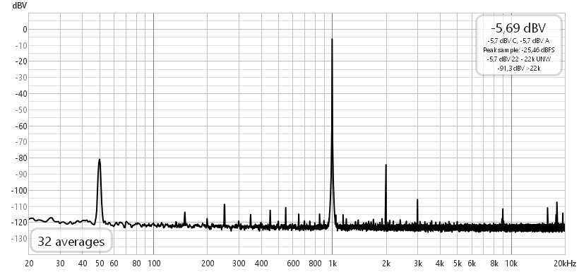
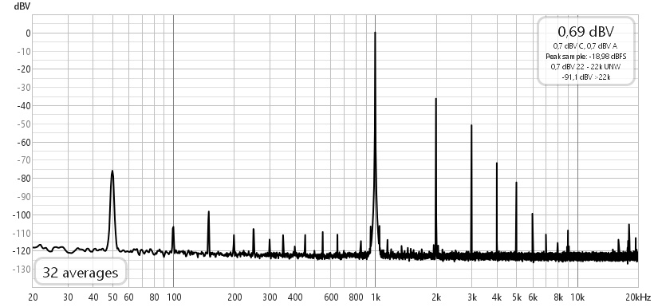
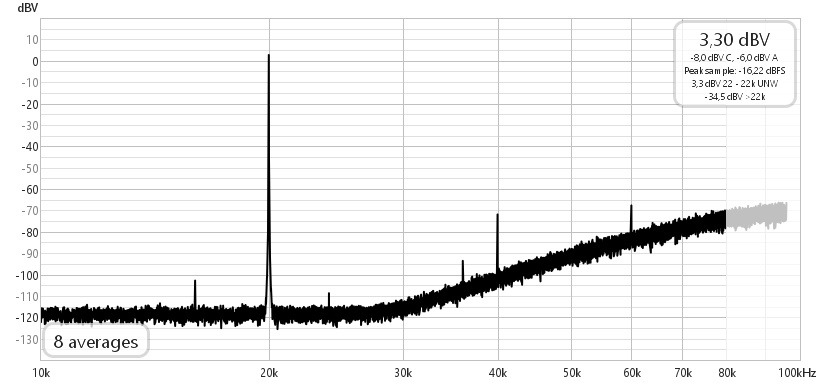
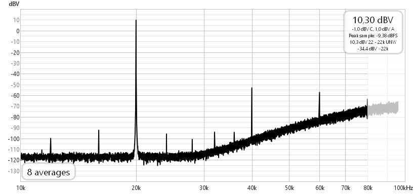

# Audio Amplifier with Tuned Distortion

A 2024 engineering project involving the design and construction of a dual-channel, solid-state audio amplifier operating in Class AB. The circuit was designed for Hi-Fi systems and is equipped with a unique, continuously adjustable distortion circuit that utilizes a JFET transistor to simulate the distortion characteristics typical of vacuum tubes.

## System Features and Properties

- Adjustable Distortion: A seamless transition from a clean signal to distortions reaching several percent, primarily emphasizing the 2nd and 3rd harmonics to simulate the "warm" sound of a triode
- Active Tone Control: A Baxandall topology circuit offering independent adjustment of the low and high-frequency bands within a $\pm 6$ dB range
- Protection and Filtering: Built-in subsonic and ultrasonic filters to protect loudspeakers from unwanted frequencies, speaker protection against DC component and an output relay turn-on delay

## Key Results and Parameters

The amplifier is characterized by highly linear operation, and its parameters meet the standards of mid-priced commercial devices.

- Nominal Power: ~25 $W_{RMS}$ per channel into an 8 Ω load
- Efficiency: Slightly over 50%
- Frequency Response: 20 Hz – 20 kHz with amplitude ripple below 0.1 dB
- THD: 0.01% [1 kHz] and 0.03% [20 kHz] at 5 W power, slightly below 0.1% at 25 W
- IMD (CCIF test): 0.01% [19 kHz + 20 kHz] at 5 W power

## Device Prototype

	

<table>
	<tr>
		<td width="50%"></td>
		<td width="50%"></td>
	</tr>
</table>

## Measurement Methodology and Testing
Hardware verification of the circuit was conducted on a dedicated measurement bench using a Focusrite Scarlett 2i2 (3rd generation) audio interface and REW analysis software. The signal from the interface's line output was fed into the preamplifier stage, while the power amplifier's output was loaded with an 8 Ω resistor. From there, the signal was routed back to the analyzer via a voltage divider.

Spectrum measurements confirmed the effective functioning of the tube distortion emulation circuit while maintaining extremely low non-linearity coefficients in clean signal mode. The measured frequency response and intermodulation distortions almost entirely aligned with the initial simulation assumptions.

The figures below show measured parameters of the device.

<table>
	<tr>
		<td width="50%"></td>
		<td width="50%"></td>
	</tr>
	<tr>
		<td align="center">Tone control: bass adjustment</td>
		<td align="center">Tone control: treble adjustment</td>
	</tr>
</table>

<table>
	<tr>
		<td width="50%"></td>
		<td width="50%"></td>
	</tr>
	<tr>
		<td align="center">Tuned distortion: clean</td>
		<td align="center">Tuned distortion: max distortion</td>
	</tr>
</table>

<table>
	<tr>
		<td width="50%"></td>
		<td width="50%"></td>
	</tr>
	<tr>
		<td align="center">Output spectrum at 5 W power</td>
		<td align="center">Output spectrum at 25 W power</td>
	</tr>
</table>